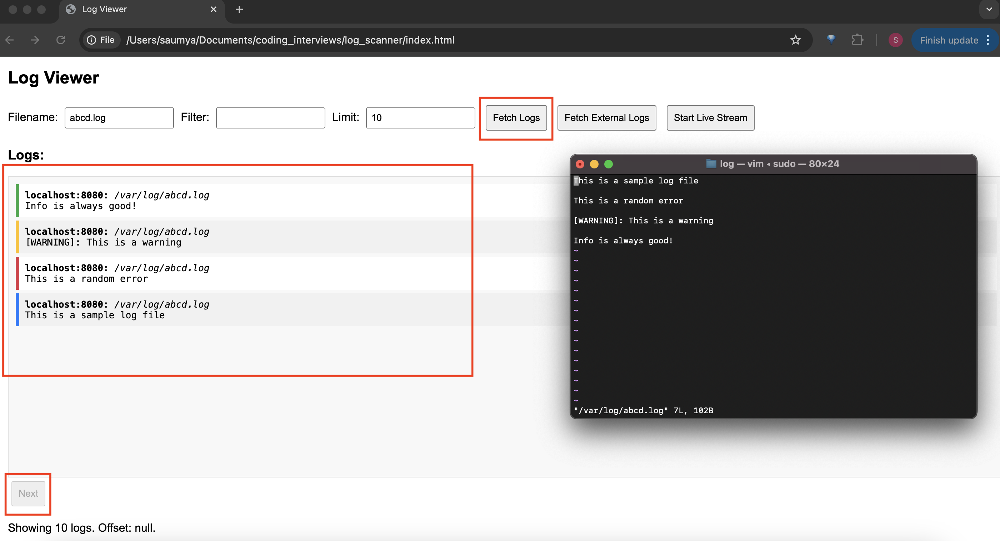
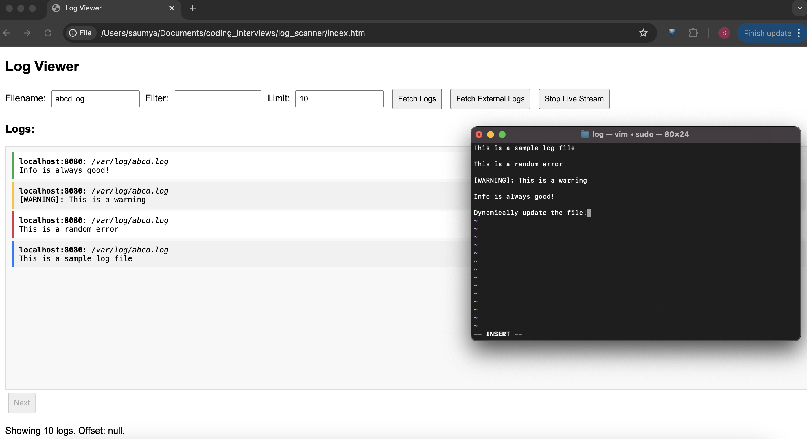
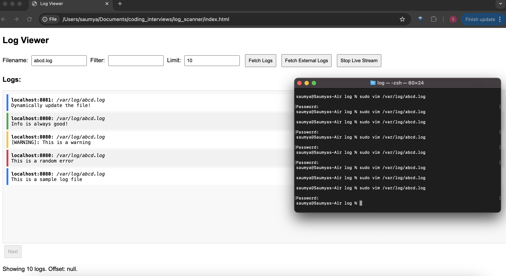
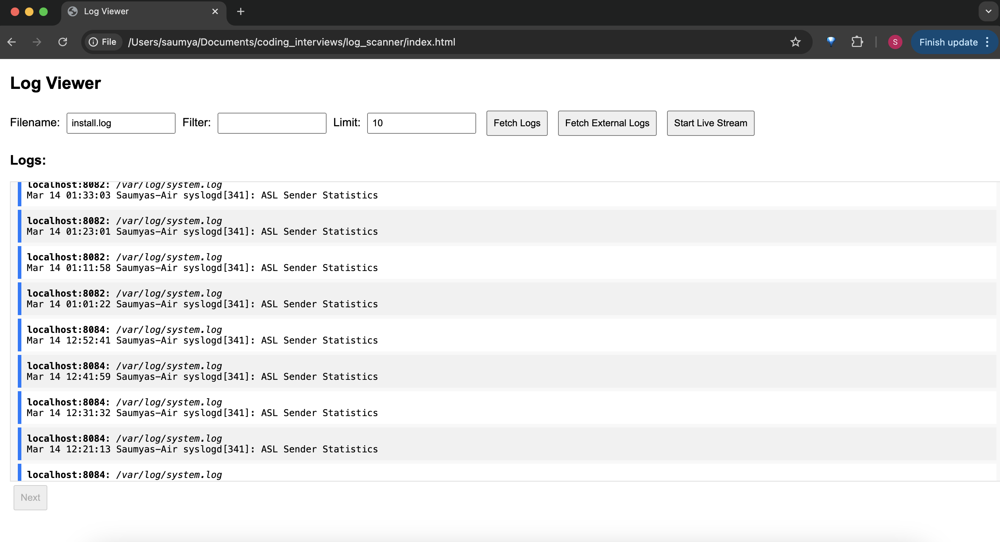

# Log Scanner Service

The log scanner service supports the APIs required for the getting logs. The following is the project structure:
```
.
├── constants.py                        constants used in the project
├── index.html                          basic UI to visualize the log scanner functionality
├── log_scanner.postman_collection.json postman collection containing http requests
├── network_utils.py                    utility functions for network operations
├── README.md                           documentation
├── requirements.txt                    requirements for running the python program
├── test_network_utils.py               tests for utility functions for network operations
├── test_utils.py                       tests for utility functions
└── utils.py                            utility functions
```

## Dependencies

- Python 3.13.0 or higher
- Python packages specified in requirements.txt
- Postman or CURL or browser for testing API endpoints

## Installation
### Running Service Locally

1. **Clone the Repository:**

   ```bash
    git clone https://github.com/Saumya-Suvarna/log_scanner.git
    cd log_scanner
   ```
2. **Create Virtual Environment:**
Create a virtual environment to install project-specific packages and avoid conflicts:

    ```bash
    python -m venv venv
    ```
3. **Activate Virtual Environment:**

    ```bash
    source venv/bin/activate
    ```
4. **Install Dependencies:**
Install the required dependencies:

    ```bash
    pip install -r requirements.txt
    ```
4. **Run the Service:**
To enable running of multiple servers (primary and secondary), the following command line arguments are supported:

    | Argument   | Default | Description |
    |------------|---------|-------------|
    | `mode`     | primary | Decides if the server will run as a primary server or a secondary server. The options are `primary` and `secondary` |
    | `port`     | 8080    | Decides which port the http server will run on |
    | `wsport`   | 8081    | Decides which port the websocket uses |

    You can run the service locally with the following command:

    ```bash
    python server.py --mode primary --port 8080 --wsport 8081
    ```
    The service will start on localhost:8080 with websocket on 8081 by default.
    Sample VScode launch config
    ```
    {
        "version": "0.2.0",
        "configurations": [
            {
                "name": "Python Debugger: Current File",
                "type": "debugpy",
                "request": "launch",
                "program": "${workspaceFolder}/server.py",
                "python": "${workspaceFolder}/venv/bin/python",
                "args": ["--mode", "secondary", "--port", "8080", "--wsport", "8081"]
            }
        ]
    }
    ```
5. **Launch UI**
Open index.html in any browswer. (Currently tested on Chrome). The functionality of the UI is explained below.

## Features

- RESTful API endpoints
- Support for query parameters to filter logs
- Basic logging and error handling
- Basic UI for visualization
- Ability to query logs from secondary servers
- Commandline argument based configuration
- Guardrails to prevent unauthorized access or harmful operations: verify symlinks, parent path and allowed extensions
- Optimization for large file reads:
    - Used memory map to improve read performance
    - Reading file in chunks
    - Reverse scanning of files (since we have to display latest logs first)
- Offset based pagination: Return file read pointer as the offset for pagination
- Dynamic log update: Update the latest logs dynamically

## API Endpoints

### Fetch Logs: **GET** `/logs`
Fetch logs from the primary server.
- **Content-Type:** `application/json`
- **Query Parameters**

    | Parameter  | Type   | Required | Description |
    |------------|--------|----------|-------------|
    | `filename` | string | No       | Name of the log file to fetch. If not provided, the latest log file is used. |
    | `filter`   | string | No       | A keyword or regex pattern to filter logs. |
    | `offset`   | int    | No       | The starting index for pagination. Defaults to the latest logs. |
    | `limit`    | int    | No       | Number of log entries to return. Default is `100`. |
    | `is_regex` | bool   | No       | Boolean flag to detect if filename is a regex expression. |
- **Request**
    Sample requests can be found in the postman collection. A sample CURL command is
    ```curl -X GET "http://localhost:8080/logs?filename=install.log&limit=50"```
-  **Response**
    The possible responses are:

    | HTTP Status Code   | Message              |
    |--------------------|----------------------|
    | 200                | \<response object\> |
    | 400                | Invalid file type |
    | 404                | No log files available |
    | 500                | Error reading logs: <error details> |

    A sample response object is:
    ```json
    {
        "pagination": {
            "offset": null,
            "limit": 10,
            "has_next": false,
            "next": null
        },
        "entries": [
            {
                "log": "[WARNING]: This is a warning",
                "source": "localhost:8080",
                "file": "/var/log/abcd.log"
            },
            {
                "log": "This is a random error",
                "source": "localhost:8080",
                "file": "/var/log/abcd.log"
            },
            {
                "log": "This is a sample log file",
                "source": "localhost:8080",
                "file": "/var/log/abcd.log"
            }
        ]
    }
    ```
### Fetch External Logs: **GET** `/fetch_external_logs`
Fetch logs from the secondary servers.

**NOTE:** Filename, filter and limit is not supported for fetching external logs. Furthermore, the external logs are not returned in a particular order.
- **Content-Type:** `application/json`
- **Query Parameters** Not currently supported.
- **Request**
    Sample requests can be found in the postman collection. A sample CURL command is
    ```curl -X GET "http://localhost:8080/fetch_external_logs"```
-  **Response**
    The possible responses are:

    | HTTP Status Code   | Message              |
    |--------------------|----------------------|
    | 200                | <response object> |
    | 400                | Invalid file type |
    | 404                | No log files available |
    | 500                | Error reading logs: <error details> |

    A sample response object is:
    ```json
    {
        "pagination": {
            "offset": null,
            "limit": null,
            "has_next": false,
            "next": null
        },
        "entries": [
            {
                "log": "[WARNING]: This is a warning",
                "source": "localhost:8082",
                "file": "/var/log/abcd.log"
            },
        ]
    }
    ```

### Get Dynamic Logs: **ws**
A websocket is set up to get the logs dynamically when an update is made to the file.
**WebSocket URL** `ws://<hostname>/<wsport>`

## UI
To launch the UI, open index.html in a browser (currently only tested on Chrome). The UI calls the APIs and displays the results. Currently the UI only runs for the default hostname and port ie `localhost:8080` which is hardcoded.

### Fetch Logs
This button calls the `/logs` API with the optional parameters filname, filter and limit. The log are displayed with the earliest logs first. If there are key word matches to error, it is highlighted with red, warning yellow, info green and all other logs are blue. At each time, the UI will display limit number of logs. To navigate to the next page, click next at the bottom.

**NOTE:** Regex for the filename is currently not supported on the UI.



### Stream Logs Dynamically
This button opens a WebSocket connection, allowing real-time communication with the server. The server monitors the file and when any data beyond the initial seek is added to the file, the server sends it to the client. If you fetched logs for a file, started streaming and then updated the file, the newest log entry will show up at the top of the page.





### Fetch External Logs
This button calls the `/fetch_external_logs` API. The logs are displayed from the secondary servers. 

**NOTE:** Filename, filter and limit is not supported for fetching external logs. Furthermore, the external logs are not returned in a particular order.




## Testing
Run unit tests locally using the following command. `pytest -v`

## Design Choices and Future Work
- Not all network calls were mocked because mocking and testing all the network calls is a fairly involved process.
- Currently no authentication process was included. In the future, advanced authentication mechanisms (JWT, Auth0) should be used for the API.
- The pagination functionality is limited currently to only show the next page url and offset. This is because of the dynamic page size based on the file chunks being read and the position of the filtered logs. In the future a more robust pagination strategy with the ability to go to the previous page should be implemented.
- A websocket is not the best choice for displaying the dynamic logs. Server sent events is a better option for one way communication from the server.
- A more robust error handling, retrying mechanism is warranted for the number of network calls being made.
- Stricter permission check should be done around which file can be read by the server. (currently we are not verifying the read permission by the user group based on the file permission)
- It is trivial to extend the fetching of logs from secondary servers to use the filter, filename etc functionality. (The primary reason why it was not implemented is because maintaining the page size is more complex to do.)
- To improve the processing of the files, we could concurrently process chunks of the file. (A little more thought has to go into limit and offset).
- Currently we are just assuming that things will be added to the log files. In the future if this assumption changes, the checksum could be used to check for changes in the file.